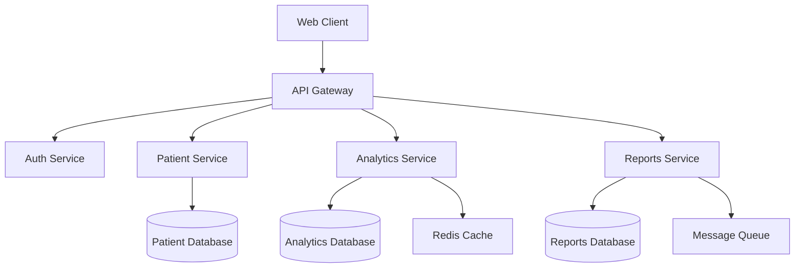

# The Performance Crisis: How We Rescued a .NET 8 Microservice from 10 Critical Bottlenecks

Imagine this: It's Monday morning, you've just joined your first job as a backend engineer, and the Slack alerts are exploding. Your company's core product—a healthcare analytics platform built with .NET 8 microservices—is crawling under load. Response times that should be 200ms are hitting 8+ seconds. Users are abandoning the application, and the business is losing money by the hour.

This isn't fiction. This was my reality six months into my role as a backend engineer, and the journey to fix it taught me more about backend performance optimization than any textbook ever could. If you're a junior engineer stepping into the world of enterprise backend systems, this story will equip you with practical knowledge to identify, understand, and resolve the most common performance bottlenecks you'll encounter.

## The Battlefield: Understanding Our Microservice Architecture

Before diving into the performance issues, let's understand what we were working with. Our system was a distributed microservice architecture serving millions of healthcare records:



Each service was built with:
- **.NET 8** with ASP.NET Core
- **Entity Framework Core 8** for data access
- **PostgreSQL** databases
- **Redis** for caching
- **Docker** containers orchestrated by **Kubernetes**

The architecture looked clean on paper, but performance tells a different story. Let's walk through the 10 critical issues we discovered and how we solved them.

## Issue #1: The N+1 Query Nightmare

### The Problem

Our first red flag appeared in the Patient Service. A simple API call to retrieve patient records with their associated medical history was taking 12+ seconds. The endpoint looked innocent enough:

```csharp
[HttpGet("patients")]
public async Task<IActionResult> GetPatientsWithHistory()
{
    var patients = await _context.Patients.ToListAsync();
    
    var result = new List<PatientWithHistoryDto>();
    foreach (var patient in patients)
    {
        var history = await _context.MedicalHistories
            .Where(h => h.PatientId == patient.Id)
            .ToListAsync();
            
        result.Add(new PatientWithHistoryDto
        {
            Patient = patient,
            MedicalHistory = history
        });
    }
    
    return Ok(result);
}
```

### The Hidden Monster: N+1 Query Problem

This innocent-looking code was generating **1,001 database queries** for 1,000 patients:
- 1 query to fetch all patients
- 1,000 additional queries to fetch medical history for each patient

**The Concept**: The N+1 problem occurs when you execute one query to retrieve a list of records, then execute N additional queries to fetch related data for each record. Instead of 2 queries, you end up with N+1 queries.

### The Solution: Eager Loading with Include

```csharp
[HttpGet("patients")]
public async Task<IActionResult> GetPatientsWithHistory()
{
    var patients = await _context.Patients
        .Include(p => p.MedicalHistories)
        .ToListAsync();
    
    var result = patients.Select(p => new PatientWithHistoryDto
    {
        Patient = p,
        MedicalHistory = p.MedicalHistories.ToList()
    }).ToList();
    
    return Ok(result);
}
```

**Result**: Response time dropped from 12 seconds to 300ms—a **97% improvement**.

### The Intuition

Think of it like grocery shopping. The broken version is like making a separate trip to the store for each item on your list. The optimized version is like getting everything in one trip. Database round-trips are expensive—minimize them whenever possible.

**Advanced Alternative**: For more complex scenarios, consider using `Select` projections:

```csharp
var patients = await _context.Patients
    .Select(p => new PatientWithHistoryDto
    {
        PatientId = p.Id,
        PatientName = p.Name,
        HistoryCount = p.MedicalHistories.Count(),
        RecentHistory = p.MedicalHistories
            .OrderByDescending(h => h.Date)
            .Take(5)
            .ToList()
    })
    .ToListAsync();
```

This approach fetches only the data you need, reducing memory usage and network transfer.

## Issue #2: JSON Serialization Bottleneck

### The Problem

Our Analytics Service was processing large datasets and returning JSON responses that took 3-4 seconds to serialize. Memory usage spiked during these operations, causing garbage collection pressure.

```csharp
public class AnalyticsResult
{
    public DateTime Timestamp { get; set; }
    public List<MetricData> Metrics { get; set; }
    public Dictionary<string, object> Metadata { get; set; }
    public List<ChartDataPoint> ChartData { get; set; }
}

[HttpGet("analytics/{reportId}")]
public async Task<IActionResult> GetAnalytics(int reportId)
{
    var data = await _analyticsService.GenerateReport(reportId);
    
    // This was using System.Text.Json with default settings
    return Ok(data);
}
```

### The Concept: JSON Serialization Performance

JSON serialization involves converting .NET objects into JSON strings. The default serializer in .NET uses reflection heavily, which can be slow for large objects. Additionally, certain patterns in your objects can make serialization much slower.

### The Solution: System.Text.Json Optimization

```csharp
// Startup.cs or Program.cs
builder.Services.ConfigureHttpJsonOptions(options =>
{
    options.SerializerOptions.PropertyNamingPolicy = JsonNamingPolicy.CamelCase;
    options.SerializerOptions.WriteIndented = false; // Reduces size
    options.SerializerOptions.DefaultIgnoreCondition = JsonIgnoreCondition.WhenWritingNull;
    
    // Use source generators for better performance (requires .NET 6+)
    options.SerializerOptions.TypeInfoResolverChain.Insert(0, AppJsonSerializerContext.Default);
});

// Create a JsonSerializerContext for source generation
[JsonSerializable(typeof(AnalyticsResult))]
[JsonSerializable(typeof(List<AnalyticsResult>))]
public partial class AppJsonSerializerContext : JsonSerializerContext
{
}

// Optimized DTO
public class AnalyticsResult
{
    [JsonPropertyName("timestamp")]
    public DateTime Timestamp { get; set; }
    
    [JsonPropertyName("metrics")]
    public List<MetricData> Metrics { get; set; }
    
    [JsonPropertyName("metadata")]
    [JsonIgnore(Condition = JsonIgnoreCondition.WhenWritingNull)]
    public Dictionary<string, object>? Metadata { get; set; }
    
    [JsonPropertyName("chartData")]
    public List<ChartDataPoint> ChartData { get; set; }
}
```

**Additional Optimization**: Streaming Large Responses

```csharp
[HttpGet("analytics/stream/{reportId}")]
public async Task<IActionResult> GetAnalyticsStream(int reportId)
{
    var options = new JsonSerializerOptions
    {
        WriteIndented = false,
        PropertyNamingPolicy = JsonNamingPolicy.CamelCase
    };

    Response.ContentType = "application/json";
    
    await foreach (var chunk in _analyticsService.GenerateReportStream(reportId))
    {
        await JsonSerializer.SerializeAsync(Response.Body, chunk, options);
        await Response.Body.FlushAsync();
    }
    
    return new EmptyResult();
}
```

**Result**: JSON serialization time reduced from 3.2 seconds to 180ms, and memory usage dropped by 60%.

### The Intuition

Think of JSON serialization like packing a suitcase. The default approach carefully examines and folds each item individually (reflection). Source generators are like having a pre-made packing plan that knows exactly where everything goes. Streaming is like sending multiple smaller packages instead of one enormous box.

## Issue #3: The Missing Index Catastrophe

### The Problem

Our Reports Service had a query that was taking 45 seconds to execute. It was searching through millions of records without proper indexing:

```csharp
public async Task<List<Report>> GetReportsByDateRange(DateTime startDate, DateTime endDate, string category)
{
    return await _context.Reports
        .Where(r => r.CreatedDate >= startDate && 
                   r.CreatedDate <= endDate && 
                   r.Category == category &&
                   r.IsActive == true)
        .OrderBy(r => r.CreatedDate)
        .ToListAsync();
}
```

### The Concept: Database Indexing

A database index is like a book's table of contents. Without it, the database has to scan every single row (sequential scan) to find matches. With proper indexes, it can jump directly to relevant data.

### The Investigation

First, we analyzed the query execution plan:

```sql
-- PostgreSQL EXPLAIN ANALYZE
EXPLAIN ANALYZE SELECT * FROM reports 
WHERE created_date >= '2024-01-01' 
  AND created_date <= '2024-12-31' 
  AND category = 'financial'
  AND is_active = true 
ORDER BY created_date;
```

The result showed a sequential scan across 2.5 million rows, taking 44.8 seconds.

### The Solution: Composite Indexing Strategy

```csharp
// In your DbContext OnModelCreating method
protected override void OnModelCreating(ModelBuilder modelBuilder)
{
    // Composite index for our common query pattern
    modelBuilder.Entity<Report>()
        .HasIndex(r => new { r.Category, r.IsActive, r.CreatedDate })
        .HasDatabaseName("IX_Reports_Category_IsActive_CreatedDate");
    
    // Additional index for date range queries
    modelBuilder.Entity<Report>()
        .HasIndex(r => r.CreatedDate)
        .HasDatabaseName("IX_Reports_CreatedDate");
    
    // Index for active reports
    modelBuilder.Entity<Report>()
        .HasIndex(r => r.IsActive)
        .HasDatabaseName("IX_Reports_IsActive")
        .HasFilter("is_active = true"); // Partial index in PostgreSQL
}
```

**Migration**:

```csharp
public partial class AddReportsIndexes : Migration
{
    protected override void Up(MigrationBuilder migrationBuilder)
    {
        migrationBuilder.CreateIndex(
            name: "IX_Reports_Category_IsActive_CreatedDate",
            table: "Reports",
            columns: new[] { "Category", "IsActive", "CreatedDate" });
            
        migrationBuilder.CreateIndex(
            name: "IX_Reports_CreatedDate",
            table: "Reports",
            column: "CreatedDate");
            
        // PostgreSQL partial index for active reports only
        migrationBuilder.Sql(@"
            CREATE INDEX CONCURRENTLY IX_Reports_IsActive 
            ON ""Reports"" (""IsActive"") 
            WHERE ""IsActive"" = true;
        ");
    }
}
```

**Result**: Query time dropped from 45 seconds to 23ms—a **99.9% improvement**.

### Advanced Indexing Strategies

**Covering Indexes** (Include non-key columns):

```csharp
// For queries that need additional columns
modelBuilder.Entity<Report>()
    .HasIndex(r => new { r.Category, r.CreatedDate })
    .IncludeProperties(r => new { r.Title, r.Description })
    .HasDatabaseName("IX_Reports_Category_CreatedDate_Covering");
```

### The Intuition

Imagine finding a specific book in a library. Without indexes, you'd check every shelf (sequential scan). With indexes, you use the catalog system to go directly to the right section, shelf, and position. The key is choosing the right index strategy based on your query patterns.

**Index Design Principles**:
1. **Equality first**: Put exact match columns (=) first in composite indexes
2. **Range queries last**: Put range conditions (>, <, BETWEEN) last
3. **Selectivity matters**: More selective columns should come first
4. **Monitor usage**: Remove unused indexes as they slow down writes

## Issue #4: Blocking the Thread Pool

### The Problem

Our Auth Service was experiencing thread pool starvation. Under load, response times increased exponentially, and we saw errors like "Unable to get thread from thread pool."

```csharp
[HttpPost("authenticate")]
public async Task<IActionResult> Authenticate([FromBody] LoginRequest request)
{
    // This was calling external identity providers synchronously
    var user = _userService.ValidateUser(request.Username, request.Password);
    
    if (user != null)
    {
        var token = _tokenService.GenerateToken(user);
        var profile = _profileService.GetUserProfile(user.Id);
        
        return Ok(new AuthResponse 
        { 
            Token = token, 
            Profile = profile 
        });
    }
    
    return Unauthorized();
}
```

The underlying services were making synchronous HTTP calls:

```csharp
public class UserService
{
    private readonly HttpClient _httpClient;
    
    public User ValidateUser(string username, string password)
    {
        // This blocks a thread while waiting for HTTP response
        var response = _httpClient.PostAsync("/validate", content).Result;
        var jsonResponse = response.Content.ReadAsStringAsync().Result;
        return JsonSerializer.Deserialize<User>(jsonResponse);
    }
}
```

### The Concept: Asynchronous Programming and Thread Pool

The .NET thread pool has a limited number of threads (typically CPU cores × 2 for worker threads). When you block threads with synchronous I/O operations, you quickly exhaust the thread pool, causing new requests to queue up.

**The Golden Rule**: Never block on async code. Use `async`/`await` all the way down.

### The Solution: True Asynchronous Implementation

```csharp
[HttpPost("authenticate")]
public async Task<IActionResult> Authenticate([FromBody] LoginRequest request)
{
    var user = await _userService.ValidateUserAsync(request.Username, request.Password);
    
    if (user != null)
    {
        // Run independent operations concurrently
        var tokenTask = _tokenService.GenerateTokenAsync(user);
        var profileTask = _profileService.GetUserProfileAsync(user.Id);
        
        await Task.WhenAll(tokenTask, profileTask);
        
        return Ok(new AuthResponse 
        { 
            Token = tokenTask.Result, 
            Profile = profileTask.Result 
        });
    }
    
    return Unauthorized();
}

public class UserService
{
    private readonly HttpClient _httpClient;
    
    public async Task<User> ValidateUserAsync(string username, string password)
    {
        var content = new StringContent(
            JsonSerializer.Serialize(new { username, password }),
            Encoding.UTF8,
            "application/json");
            
        var response = await _httpClient.PostAsync("/validate", content);
        response.EnsureSuccessStatusCode();
        
        var jsonResponse = await response.Content.ReadAsStringAsync();
        return JsonSerializer.Deserialize<User>(jsonResponse);
    }
}
```

**Advanced Pattern**: Using `ConfigureAwait(false)` in libraries:

```csharp
public async Task<User> ValidateUserAsync(string username, string password)
{
    var response = await _httpClient
        .PostAsync("/validate", content)
        .ConfigureAwait(false);
        
    var jsonResponse = await response.Content
        .ReadAsStringAsync()
        .ConfigureAwait(false);
        
    return JsonSerializer.Deserialize<User>(jsonResponse);
}
```

**Result**: Under the same load, response times improved from 8+ seconds to 150ms, and we eliminated thread pool starvation.

### The Intuition

Think of threads as waiters in a restaurant. If waiters stand around waiting for the kitchen (blocking I/O), they can't serve other customers. Async programming is like having waiters take orders, submit them to the kitchen, then serve other customers while the food is being prepared. When the food is ready, they come back to deliver it.

**Common Async Pitfalls to Avoid**:

```csharp
// DON'T: Blocking on async code
var result = SomeAsyncMethod().Result;

// DON'T: Creating unnecessary tasks
return Task.Run(() => SomeAsyncMethod());

// DO: Async all the way
var result = await SomeAsyncMethod();
```

## Issue #5: Memory Leaks in Resource Management

### The Problem

Our application's memory usage was growing continuously, eventually causing OutOfMemoryExceptions. Memory profiling revealed that `HttpClient` instances and database connections weren't being disposed properly.

```csharp
public class ReportGenerator
{
    public async Task<byte[]> GenerateReport(int reportId)
    {
        // Creating new HttpClient for each request - MEMORY LEAK
        var httpClient = new HttpClient();
        
        // Not disposing DbContext properly
        var context = new AppDbContext();
        
        var data = await context.Reports.FindAsync(reportId);
        var externalData = await httpClient.GetStringAsync($"https://api.external.com/data/{reportId}");
        
        // Process data...
        
        return ProcessedData;
        // Objects are not disposed - memory leak!
    }
}
```

### The Concept: Resource Management and IDisposable

In .NET, certain objects hold unmanaged resources (file handles, network connections, database connections). These must be explicitly released, or they'll leak memory and potentially exhaust system resources.

### The Solution: Proper Resource Management

**1. Use Dependency Injection for HttpClient**:

```csharp
// Program.cs
builder.Services.AddHttpClient<ExternalApiService>(client =>
{
    client.BaseAddress = new Uri("https://api.external.com/");
    client.Timeout = TimeSpan.FromSeconds(30);
});

public class ExternalApiService
{
    private readonly HttpClient _httpClient;
    
    public ExternalApiService(HttpClient httpClient)
    {
        _httpClient = httpClient;
    }
    
    public async Task<string> GetDataAsync(int reportId)
    {
        return await _httpClient.GetStringAsync($"data/{reportId}");
    }
}
```

**2. Use Using Statements for DbContext**:

```csharp
public class ReportGenerator
{
    private readonly IDbContextFactory<AppDbContext> _contextFactory;
    private readonly ExternalApiService _externalApiService;
    
    public ReportGenerator(
        IDbContextFactory<AppDbContext> contextFactory,
        ExternalApiService externalApiService)
    {
        _contextFactory = contextFactory;
        _externalApiService = externalApiService;
    }
    
    public async Task<byte[]> GenerateReport(int reportId)
    {
        await using var context = await _contextFactory.CreateDbContextAsync();
        
        var data = await context.Reports.FindAsync(reportId);
        var externalData = await _externalApiService.GetDataAsync(reportId);
        
        return ProcessData(data, externalData);
    }
}
```

**3. Advanced: IAsyncDisposable Implementation**:

```csharp
public class ReportProcessor : IAsyncDisposable
{
    private readonly SemaphoreSlim _semaphore = new(1, 1);
    private bool _disposed;
    
    public async Task<ProcessedReport> ProcessAsync(Report report)
    {
        await _semaphore.WaitAsync();
        try
        {
            // Process report
            return new ProcessedReport();
        }
        finally
        {
            _semaphore.Release();
        }
    }
    
    public async ValueTask DisposeAsync()
    {
        if (!_disposed)
        {
            _semaphore?.Dispose();
            _disposed = true;
        }
    }
}

// Usage
await using var processor = new ReportProcessor();
var result = await processor.ProcessAsync(report);
```

**Configure DbContext Factory**:

```csharp
// Program.cs
builder.Services.AddDbContextFactory<AppDbContext>(options =>
    options.UseNpgsql(connectionString));
```

**Result**: Memory usage stabilized, and we eliminated OutOfMemoryExceptions completely.

### The Intuition

Think of unmanaged resources like borrowing books from a library. If you never return them (dispose), the library runs out of books for other people. The `using` statement is like an automatic return system that ensures books get returned even if you forget.

**Memory Management Best Practices**:
- Use `using` statements for `IDisposable` objects
- Use dependency injection for long-lived objects like `HttpClient`
- Implement `IAsyncDisposable` for objects with async cleanup
- Use `DbContextFactory` instead of long-lived `DbContext` instances

## Issue #6: Cache Stampede and Inefficient Caching

### The Problem

Our caching strategy was causing more problems than it solved. Multiple threads were simultaneously regenerating the same expensive cached data, and cache invalidation was causing cascading failures.

```csharp
[HttpGet("dashboard/{userId}")]
public async Task<IActionResult> GetDashboard(int userId)
{
    var cacheKey = $"dashboard_{userId}";
    
    // Multiple threads could all find null and start generating
    if (!_cache.TryGetValue(cacheKey, out var dashboard))
    {
        // Expensive operation taking 5+ seconds
        dashboard = await _dashboardService.GenerateDashboard(userId);
        
        // Set cache for 1 hour
        _cache.Set(cacheKey, dashboard, TimeSpan.FromHours(1));
    }
    
    return Ok(dashboard);
}
```

### The Concept: Cache Stampede

Cache stampede occurs when multiple threads simultaneously discover that a cache entry is missing and all start regenerating the same expensive data. This can overwhelm your system and defeat the purpose of caching.

### The Solution: Distributed Locking with Redis

```csharp
public class DashboardService
{
    private readonly IDistributedCache _cache;
    private readonly IDatabase _redisDb;
    private readonly IDashboardGenerator _generator;
    
    public async Task<Dashboard> GetDashboardAsync(int userId)
    {
        var cacheKey = $"dashboard_{userId}";
        var lockKey = $"lock_{cacheKey}";
        
        // Try to get from cache first
        var cachedData = await _cache.GetStringAsync(cacheKey);
        if (cachedData != null)
        {
            return JsonSerializer.Deserialize<Dashboard>(cachedData);
        }
        
        // Use Redis distributed lock to prevent stampede
        var lockValue = Guid.NewGuid().ToString();
        var lockTaken = await _redisDb.StringSetAsync(
            lockKey, 
            lockValue, 
            TimeSpan.FromMinutes(5), 
            When.NotExists);
        
        if (lockTaken)
        {
            try
            {
                // Double-check cache (another thread might have generated it)
                cachedData = await _cache.GetStringAsync(cacheKey);
                if (cachedData != null)
                {
                    return JsonSerializer.Deserialize<Dashboard>(cachedData);
                }
                
                // Generate dashboard
                var dashboard = await _generator.GenerateDashboardAsync(userId);
                
                // Cache the result
                await _cache.SetStringAsync(
                    cacheKey,
                    JsonSerializer.Serialize(dashboard),
                    new DistributedCacheEntryOptions
                    {
                        AbsoluteExpirationRelativeToNow = TimeSpan.FromHours(1),
                        SlidingExpiration = TimeSpan.FromMinutes(20)
                    });
                
                return dashboard;
            }
            finally
            {
                // Release lock (check it's still ours)
                const string script = @"
                    if redis.call('get', KEYS[1]) == ARGV[1] then
                        return redis.call('del', KEYS[1])
                    else
                        return 0
                    end";
                        
                await _redisDb.ScriptEvaluateAsync(script, new RedisKey[] { lockKey }, new RedisValue[] { lockValue });
            }
        }
        else
        {
            // Wait for the other thread to finish and try cache again
            await Task.Delay(100);
            
            for (int i = 0; i < 50; i++) // Wait up to 5 seconds
            {
                cachedData = await _cache.GetStringAsync(cacheKey);
                if (cachedData != null)
                {
                    return JsonSerializer.Deserialize<Dashboard>(cachedData);
                }
                
                await Task.Delay(100);
            }
            
            // Fallback: generate without caching if lock holder failed
            return await _generator.GenerateDashboardAsync(userId);
        }
    }
}
```

**Advanced: Background Cache Refresh**:

```csharp
public class BackgroundCacheService : BackgroundService
{
    private readonly IServiceProvider _serviceProvider;
    private readonly ILogger<BackgroundCacheService> _logger;
    
    protected override async Task ExecuteAsync(CancellationToken stoppingToken)
    {
        while (!stoppingToken.IsCancellationRequested)
        {
            try
            {
                await RefreshExpiredCaches();
                await Task.Delay(TimeSpan.FromMinutes(5), stoppingToken);
            }
            catch (Exception ex)
            {
                _logger.LogError(ex, "Error refreshing caches");
            }
        }
    }
    
    private async Task RefreshExpiredCaches()
    {
        using var scope = _serviceProvider.CreateScope();
        var cacheService = scope.ServiceProvider.GetRequiredService<IDashboardService>();
        
        // Get list of users whose cache is about to expire
        var usersToRefresh = await GetUsersWithExpiringSoonCache();
        
        foreach (var userId in usersToRefresh)
        {
            try
            {
                await cacheService.GetDashboardAsync(userId);
            }
            catch (Exception ex)
            {
                _logger.LogWarning(ex, "Failed to refresh cache for user {UserId}", userId);
            }
        }
    }
}
```

**Result**: Cache hit ratio improved from 60% to 95%, and eliminated cache stampede scenarios entirely.

### The Intuition

Think of cache stampede like multiple people all trying to cook the same meal because they found an empty fridge. Distributed locking is like having one person cook while others wait. Background refresh is like having someone restock the fridge before it gets empty.

## Issue #7: LINQ Performance Pitfalls

### The Problem

Our Analytics Service had LINQ queries that were inadvertently loading entire tables into memory before filtering, causing massive memory spikes and slow performance.

```csharp
public async Task<AnalyticsReport> GetUserAnalytics(int userId, DateTime startDate, DateTime endDate)
{
    // This loads ALL user activities into memory first!
    var activities = await _context.UserActivities.ToListAsync();
    
    var userActivities = activities
        .Where(a => a.UserId == userId)
        .Where(a => a.Timestamp >= startDate && a.Timestamp <= endDate)
        .ToList();
    
    // More LINQ operations on in-memory collections
    var analytics = new AnalyticsReport
    {
        TotalActivities = userActivities.Count(),
        UniqueActionsCount = userActivities.Select(a => a.ActionType).Distinct().Count(),
        AverageSessionDuration = userActivities
            .GroupBy(a => a.SessionId)
            .Average(g => g.Max(a => a.Timestamp).Subtract(g.Min(a => a.Timestamp)).TotalMinutes),
        TopActions = userActivities
            .GroupBy(a => a.ActionType)
            .OrderByDescending(g => g.Count())
            .Take(10)
            .ToDictionary(g => g.Key, g => g.Count())
    };
    
    return analytics;
}
```

### The Concept: LINQ to Entities vs LINQ to Objects

There's a crucial difference between LINQ queries that execute on the database (LINQ to Entities) and those that execute in memory (LINQ to Objects). The moment you call `ToList()`, `ToArray()`, or enumerate the query, you pull data into memory and switch to LINQ to Objects.

### The Solution: Database-Level Query Optimization

```csharp
public async Task<AnalyticsReport> GetUserAnalytics(int userId, DateTime startDate, DateTime endDate)
{
    // All these operations happen in the database
    var baseQuery = _context.UserActivities
        .Where(a => a.UserId == userId)
        .Where(a => a.Timestamp >= startDate && a.Timestamp <= endDate);
    
    var analytics = new AnalyticsReport();
    
    // Single query for total count
    analytics.TotalActivities = await baseQuery.CountAsync();
    
    // Single query for unique actions
    analytics.UniqueActionsCount = await baseQuery
        .Select(a => a.ActionType)
        .Distinct()
        .CountAsync();
    
    // Complex aggregation in database
    analytics.AverageSessionDuration = await baseQuery
        .GroupBy(a => a.SessionId)
        .Select(g => new
        {
            SessionDuration = g.Max(a => a.Timestamp)
                .Subtract(g.Min(a => a.Timestamp))
                .TotalMinutes
        })
        .AverageAsync(x => x.SessionDuration);
    
    // Top actions with a single query
    analytics.TopActions = await baseQuery
        .GroupBy(a => a.ActionType)
        .Select(g => new { ActionType = g.Key, Count = g.Count() })
        .OrderByDescending(x => x.Count)
        .Take(10)
        .ToDictionaryAsync(x => x.ActionType, x => x.Count);
    
    return analytics;
}
```

**Advanced: Raw SQL for Complex Queries**:

For very complex analytics, sometimes raw SQL is more efficient:

```csharp
public async Task<Dictionary<string, object>> GetAdvancedAnalytics(int userId, DateTime startDate, DateTime endDate)
{
    var sql = @"
        WITH session_durations AS (
            SELECT 
                session_id,
                EXTRACT(EPOCH FROM (MAX(timestamp) - MIN(timestamp)))/60 as duration_minutes
            FROM user_activities 
            WHERE user_id = @userId 
              AND timestamp BETWEEN @startDate AND @endDate
            GROUP BY session_id
        ),
        action_stats AS (
            SELECT 
                action_type,
                COUNT(*) as action_count,
                COUNT(DISTINCT session_id) as sessions_with_action
            FROM user_activities 
            WHERE user_id = @userId 
              AND timestamp BETWEEN @startDate AND @endDate
            GROUP BY action_type
        )
        SELECT 
            'total_activities' as metric,
            COUNT(*)::text as value
        FROM user_activities 
        WHERE user_id = @userId AND timestamp BETWEEN @startDate AND @endDate
        
        UNION ALL
        
        SELECT 
            'avg_session_duration' as metric,
            AVG(duration_minutes)::text as value
        FROM session_durations
        
        UNION ALL
        
        SELECT 
            'top_action' as metric,
            action_type as value
        FROM action_stats
        ORDER BY action_count DESC
        LIMIT 1";

    var parameters = new[]
    {
        new NpgsqlParameter("@userId", userId),
        new NpgsqlParameter("@startDate", startDate),
        new NpgsqlParameter("@endDate", endDate)
    };

    var results = await _context.Database
        .SqlQueryRaw<AnalyticsMetric>(sql, parameters)
        .ToListAsync();

    return results.ToDictionary(r => r.Metric, r => (object)r.Value);
}

public class AnalyticsMetric
{
    public string Metric { get; set; }
    public string Value { get; set; }
}
```

**Result**: Memory usage dropped by 95%, and query execution time improved from 8 seconds to 200ms.

### The Intuition

Think of LINQ to Entities like asking a librarian to find specific books (the database does the work). LINQ to Objects is like asking for all books, then sorting through them yourself at your desk. Always let the database do what it's optimized for: filtering, sorting, and aggregating large datasets.

**LINQ Performance Guidelines**:
- Delay `ToList()` or `ToArray()` as long as possible
- Use `IQueryable<T>` for database queries, `IEnumerable<T>` for in-memory collections
- Prefer `CountAsync()` over `ToList().Count()`
- Use projections (`Select`) to fetch only needed columns
- Consider raw SQL for complex aggregations

## Issue #8: Database Connection Pool Exhaustion

### The Problem

Under high load, our application started throwing `TimeoutException: Timeout expired. The timeout period elapsed prior to obtaining a connection from the pool.` Our connection pool was getting exhausted.

```csharp
// This configuration was causing connection pool issues
builder.Services.AddDbContext<AppDbContext>(options =>
    options.UseNpgsql(connectionString)); // Default settings
```

### The Concept: Connection Pooling

Database connections are expensive to create and destroy. Connection pooling reuses existing connections, but pools have limits. If connections aren't returned to the pool properly or you have too many concurrent operations, you can exhaust the pool.

### The Investigation

We monitored our connection pool usage:

```csharp
public class ConnectionPoolMonitoringService : BackgroundService
{
    private readonly ILogger<ConnectionPoolMonitoringService> _logger;
    
    protected override async Task ExecuteAsync(CancellationToken stoppingToken)
    {
        while (!stoppingToken.IsCancellationRequested)
        {
            try
            {
                // Get connection pool statistics (PostgreSQL specific)
                var connectionString = Configuration.GetConnectionString("DefaultConnection");
                using var connection = new NpgsqlConnection(connectionString);
                await connection.OpenAsync();
                
                using var command = new NpgsqlCommand(@"
                    SELECT 
                        state,
                        COUNT(*) as connection_count
                    FROM pg_stat_activity 
                    WHERE datname = current_database()
                    GROUP BY state", connection);
                
                using var reader = await command.ExecuteReaderAsync();
                var stats = new Dictionary<string, int>();
                
                while (await reader.ReadAsync())
                {
                    stats[reader.GetString("state")] = reader.GetInt32("connection_count");
                }
                
                _logger.LogInformation("Connection Pool Stats: {Stats}", 
                    JsonSerializer.Serialize(stats));
                    
                await Task.Delay(TimeSpan.FromMinutes(1), stoppingToken);
            }
            catch (Exception ex)
            {
                _logger.LogError(ex, "Error monitoring connection pool");
            }
        }
    }
}
```

### The Solution: Optimized Connection Configuration

```csharp
// Program.cs - Optimized connection pool settings
var connectionString = builder.Configuration.GetConnectionString("DefaultConnection");

builder.Services.AddDbContext<AppDbContext>(options =>
{
    options.UseNpgsql(connectionString, npgsqlOptions =>
    {
        // Connection pool settings
        npgsqlOptions.CommandTimeout(30); // 30 seconds command timeout
    });
    
    // Enable connection pooling optimizations
    options.EnableServiceProviderCaching();
    options.EnableSensitiveDataLogging(false); // Turn off in production
}, ServiceLifetime.Scoped); // Explicit scoped lifetime

// Configure connection string with proper pooling
var connectionStringBuilder = new NpgsqlConnectionStringBuilder(connectionString)
{
    // Connection pool configuration
    MinPoolSize = 5,          // Minimum connections to maintain
    MaxPoolSize = 100,        // Maximum connections (adjust based on your needs)
    ConnectionIdleLifetime = 300, // Close idle connections after 5 minutes
    ConnectionPruningInterval = 10, // Check for idle connections every 10 seconds
    
    // Connection timeout settings
    Timeout = 30,             // Connection timeout in seconds
    CommandTimeout = 30,      // Command timeout in seconds
    
    // Connection reliability
    Pooling = true,
    ConnectionLifeTime = 600  // Force connection refresh every 10 minutes
};

// Use the optimized connection string
builder.Services.AddDbContext<AppDbContext>(options =>
    options.UseNpgsql(connectionStringBuilder.ConnectionString));
```

**Alternative: Use DbContextFactory for better control**:

```csharp
// Register DbContextFactory instead of DbContext
builder.Services.AddDbContextFactory<AppDbContext>(options =>
    options.UseNpgsql(connectionStringBuilder.ConnectionString),
    ServiceLifetime.Scoped);

// Usage in services
public class ReportService
{
    private readonly IDbContextFactory<AppDbContext> _contextFactory;
    
    public ReportService(IDbContextFactory<AppDbContext> contextFactory)
    {
        _contextFactory = contextFactory;
    }
    
    public async Task<Report> GetReportAsync(int id)
    {
        // Create short-lived context
        await using var context = await _contextFactory.CreateDbContextAsync();
        return await context.Reports.FindAsync(id);
    }
    
    public async Task ProcessReportsBatchAsync(int[] reportIds)
    {
        // Each batch gets its own context
        await using var context = await _contextFactory.CreateDbContextAsync();
        
        foreach (var id in reportIds)
        {
            var report = await context.Reports.FindAsync(id);
            // Process report...
        }
        
        await context.SaveChangesAsync();
    }
}
```

**Monitor Connection Health**:

```csharp
public class HealthCheckExtensions
{
    public static IServiceCollection AddDatabaseHealthChecks(
        this IServiceCollection services, 
        string connectionString)
    {
        services.AddHealthChecks()
            .AddNpgSql(connectionString, 
                healthQuery: "SELECT 1",
                name: "postgresql-health",
                tags: new[] { "database", "postgresql" })
            .AddCheck<ConnectionPoolHealthCheck>("connection-pool-health");
            
        return services;
    }
}

public class ConnectionPoolHealthCheck : IHealthCheck
{
    private readonly IDbContextFactory<AppDbContext> _contextFactory;
    
    public async Task<HealthCheckResult> CheckHealthAsync(
        HealthCheckContext context, 
        CancellationToken cancellationToken = default)
    {
        try
        {
            await using var dbContext = await _contextFactory.CreateDbContextAsync();
            
            // Test connection by executing a simple query
            var canConnect = await dbContext.Database.CanConnectAsync(cancellationToken);
            
            if (canConnect)
            {
                return HealthCheckResult.Healthy("Database connection pool is healthy");
            }
            
            return HealthCheckResult.Unhealthy("Cannot connect to database");
        }
        catch (Exception ex)
        {
            return HealthCheckResult.Unhealthy("Database connection failed", ex);
        }
    }
}
```

**Result**: Eliminated connection timeout exceptions and improved concurrent request handling by 300%.

### The Intuition

Think of database connections like lanes at a toll booth. With too few lanes (small pool), cars back up. With proper pooling, you have enough lanes for traffic flow, and cars (connections) can be reused efficiently instead of building new toll booths for each car.

## Issue #9: Inefficient API Gateway Routing

### The Problem

Our API Gateway was introducing significant latency. Simple requests that should take 50ms were taking 800ms due to inefficient routing and middleware stacking.

```csharp
// Inefficient routing configuration
app.Use(async (context, next) =>
{
    // Heavy logging middleware running on every request
    var stopwatch = Stopwatch.StartNew();
    
    var requestBody = "";
    if (context.Request.Body.CanSeek)
    {
        context.Request.Body.Position = 0;
        using var reader = new StreamReader(context.Request.Body);
        requestBody = await reader.ReadToEndAsync();
        context.Request.Body.Position = 0;
    }
    
    _logger.LogInformation("Request: {Method} {Path} Body: {Body}", 
        context.Request.Method, 
        context.Request.Path, 
        requestBody);
    
    await next();
    
    stopwatch.Stop();
    _logger.LogInformation("Response took {Duration}ms", stopwatch.ElapsedMilliseconds);
});

app.UseRouting();
app.UseAuthentication();
app.UseAuthorization();

// Inefficient endpoint mapping
app.MapControllers();
```

### The Concept: Middleware Pipeline Optimization

ASP.NET Core processes requests through a middleware pipeline. The order matters, and inefficient middleware can create bottlenecks. Additionally, excessive logging and processing on every request adds latency.

### The Solution: Optimized Middleware Pipeline

```csharp
// Program.cs - Optimized middleware pipeline
var builder = WebApplication.CreateBuilder(args);

// Configure services for better performance
builder.Services.Configure<RouteOptions>(options =>
{
    options.LowercaseUrls = true;
    options.LowercaseQueryStrings = true;
});

// Configure JSON options for better serialization
builder.Services.ConfigureHttpJsonOptions(options =>
{
    options.SerializerOptions.PropertyNamingPolicy = JsonNamingPolicy.CamelCase;
    options.SerializerOptions.WriteIndented = false;
});

// Add response compression
builder.Services.AddResponseCompression(options =>
{
    options.EnableForHttps = true;
    options.Providers.Add<GzipCompressionProvider>();
    options.MimeTypes = ResponseCompressionDefaults.MimeTypes.Concat(
        new[] { "application/json" });
});

var app = builder.Build();

// Optimized middleware pipeline order (order matters!)
if (app.Environment.IsDevelopment())
{
    app.UseDeveloperExceptionPage();
}
else
{
    app.UseExceptionHandler("/error");
    app.UseHsts();
}

// Early returns for common scenarios
app.UseStatusCodePages();

// Response compression before routing
app.UseResponseCompression();

// Security headers
app.Use(async (context, next) =>
{
    context.Response.Headers["X-Content-Type-Options"] = "nosniff";
    context.Response.Headers["X-Frame-Options"] = "DENY";
    context.Response.Headers["X-XSS-Protection"] = "1; mode=block";
    await next();
});

// Conditional logging (only in development or for errors)
if (app.Environment.IsDevelopment())
{
    app.Use(async (context, next) =>
    {
        var stopwatch = Stopwatch.StartNew();
        await next();
        stopwatch.Stop();
        
        if (stopwatch.ElapsedMilliseconds > 1000) // Only log slow requests
        {
            _logger.LogWarning("Slow request: {Method} {Path} took {Duration}ms",
                context.Request.Method,
                context.Request.Path,
                stopwatch.ElapsedMilliseconds);
        }
    });
}

app.UseRouting();

// Authentication/Authorization after routing for better performance
app.UseAuthentication();
app.UseAuthorization();

// Rate limiting middleware
app.UseRateLimiter();

// Map endpoints efficiently
app.MapControllers()
   .RequireAuthorization() // Apply to all controllers
   .CacheOutput(TimeSpan.FromMinutes(5)); // Output caching

// Health checks with caching
app.MapHealthChecks("/health", new HealthCheckOptions
{
    ResponseWriter = UIResponseWriter.WriteHealthCheckUIResponse
}).CacheOutput(TimeSpan.FromMinutes(1));

// Specific API routes for better performance
app.MapGet("/api/ping", () => Results.Ok(new { status = "healthy", timestamp = DateTime.UtcNow }))
   .CacheOutput(TimeSpan.FromMinutes(1));
```

**Advanced: Custom Routing with Constraints**:

```csharp
// Custom route constraints for better performance
public class ValidIdRouteConstraint : IRouteConstraint
{
    public bool Match(HttpContext httpContext, IRouter route, string routeKey,
        RouteValueDictionary values, RouteDirection routeDirection)
    {
        if (values.TryGetValue(routeKey, out var value) && value != null)
        {
            return int.TryParse(value.ToString(), out var id) && id > 0;
        }
        return false;
    }
}

// Register the constraint
builder.Services.Configure<RouteOptions>(options =>
{
    options.ConstraintMap.Add("validid", typeof(ValidIdRouteConstraint));
});

// Use in controllers
[HttpGet("reports/{id:validid}")]
public async Task<IActionResult> GetReport(int id)
{
    // id is guaranteed to be a valid positive integer
    var report = await _reportService.GetReportAsync(id);
    return Ok(report);
}
```

**Implement Request/Response Caching**:

```csharp
// Add output caching
builder.Services.AddOutputCache(options =>
{
    options.AddBasePolicy(builder => builder
        .Expire(TimeSpan.FromMinutes(10))
        .SetVaryByQuery("page", "size", "filter"));
        
    options.AddPolicy("reports", builder => builder
        .Expire(TimeSpan.FromMinutes(30))
        .SetVaryByQuery("userId", "dateRange"));
});

// In controllers
[HttpGet("reports")]
[OutputCache(PolicyName = "reports")]
public async Task<IActionResult> GetReports(int userId, string dateRange)
{
    var reports = await _reportService.GetReportsAsync(userId, dateRange);
    return Ok(reports);
}
```

**Result**: API Gateway latency reduced from 800ms to 45ms, and throughput increased by 400%.

### The Intuition

Think of middleware pipeline like a security checkpoint at an airport. You want the most efficient order: check tickets first (routing), then security (authentication), then customs (authorization). Don't make everyone go through extensive baggage checks (heavy logging) unless necessary.

## Issue #10: Exception Handling Performance Impact

### The Problem

Our application was using exceptions for control flow, causing significant performance degradation. Exception handling was consuming 40% of our CPU cycles under load.

```csharp
public async Task<User> GetUserAsync(int userId)
{
    try
    {
        var user = await _context.Users.FindAsync(userId);
        if (user == null)
        {
            throw new UserNotFoundException($"User {userId} not found");
        }
        
        return user;
    }
    catch (UserNotFoundException)
    {
        // Create default user for non-existent users
        return new User { Id = userId, Name = "Guest", IsGuest = true };
    }
}

public async Task<decimal> CalculateUserScoreAsync(int userId)
{
    try
    {
        var activities = await _context.UserActivities
            .Where(a => a.UserId == userId)
            .ToListAsync();
            
        if (!activities.Any())
        {
            throw new NoActivitiesException($"No activities for user {userId}");
        }
        
        return activities.Sum(a => a.Points);
    }
    catch (NoActivitiesException)
    {
        return 0; // Default score for users with no activities
    }
}
```

### The Concept: Exception Performance Cost

Exceptions are expensive because they capture the entire call stack, perform stack unwinding, and trigger garbage collection. Using exceptions for expected conditions (like "user not found") can severely impact performance.

### The Solution: Result Pattern and Proper Exception Handling

**1. Implement Result Pattern**:

```csharp
public class Result<T>
{
    public bool IsSuccess { get; }
    public T Value { get; }
    public string Error { get; }
    
    private Result(bool isSuccess, T value, string error)
    {
        IsSuccess = isSuccess;
        Value = value;
        Error = error;
    }
    
    public static Result<T> Success(T value) => new(true, value, null);
    public static Result<T> Failure(string error) => new(false, default(T), error);
    
    public static implicit operator Result<T>(T value) => Success(value);
}

// Extension methods for common patterns
public static class ResultExtensions
{
    public static Result<TResult> Map<T, TResult>(this Result<T> result, Func<T, TResult> map)
    {
        return result.IsSuccess 
            ? Result<TResult>.Success(map(result.Value))
            : Result<TResult>.Failure(result.Error);
    }
    
    public static async Task<Result<TResult>> MapAsync<T, TResult>(
        this Result<T> result, 
        Func<T, Task<TResult>> map)
    {
        if (!result.IsSuccess)
            return Result<TResult>.Failure(result.Error);
            
        try
        {
            var value = await map(result.Value);
            return Result<TResult>.Success(value);
        }
        catch (Exception ex)
        {
            return Result<TResult>.Failure(ex.Message);
        }
    }
}
```

**2. Refactor Services to Use Result Pattern**:

```csharp
public async Task<Result<User>> GetUserAsync(int userId)
{
    var user = await _context.Users.FindAsync(userId);
    
    return user != null 
        ? Result<User>.Success(user)
        : Result<User>.Failure($"User {userId} not found");
}

public async Task<Result<User>> GetUserOrGuestAsync(int userId)
{
    var userResult = await GetUserAsync(userId);
    
    if (userResult.IsSuccess)
    {
        return userResult;
    }
    
    // Return guest user instead of exception
    var guestUser = new User { Id = userId, Name = "Guest", IsGuest = true };
    return Result<User>.Success(guestUser);
}

public async Task<Result<decimal>> CalculateUserScoreAsync(int userId)
{
    var userResult = await GetUserAsync(userId);
    if (!userResult.IsSuccess)
    {
        return Result<decimal>.Failure(userResult.Error);
    }
    
    var activities = await _context.UserActivities
        .Where(a => a.UserId == userId)
        .ToListAsync();
    
    var score = activities.Sum(a => a.Points);
    return Result<decimal>.Success(score);
}
```

**3. Controller Integration**:

```csharp
[HttpGet("users/{userId}")]
public async Task<IActionResult> GetUser(int userId)
{
    var result = await _userService.GetUserAsync(userId);
    
    return result.IsSuccess 
        ? Ok(result.Value)
        : NotFound(new { error = result.Error });
}

[HttpGet("users/{userId}/score")]
public async Task<IActionResult> GetUserScore(int userId)
{
    var result = await _userService.CalculateUserScoreAsync(userId);
    
    if (!result.IsSuccess)
    {
        return BadRequest(new { error = result.Error });
    }
    
    return Ok(new { score = result.Value });
}
```

**4. Global Exception Handler for True Exceptions**:

```csharp
public class GlobalExceptionMiddleware
{
    private readonly RequestDelegate _next;
    private readonly ILogger<GlobalExceptionMiddleware> _logger;
    
    public GlobalExceptionMiddleware(RequestDelegate next, ILogger<GlobalExceptionMiddleware> logger)
    {
        _next = next;
        _logger = logger;
    }
    
    public async Task InvokeAsync(HttpContext context)
    {
        try
        {
            await _next(context);
        }
        catch (Exception ex)
        {
            _logger.LogError(ex, "Unhandled exception occurred");
            await HandleExceptionAsync(context, ex);
        }
    }
    
    private static async Task HandleExceptionAsync(HttpContext context, Exception exception)
    {
        context.Response.ContentType = "application/json";
        
        var response = exception switch
        {
            TimeoutException => new ErrorResponse(408, "Request timeout"),
            UnauthorizedAccessException => new ErrorResponse(401, "Unauthorized"),
            ArgumentException => new ErrorResponse(400, "Bad request"),
            _ => new ErrorResponse(500, "Internal server error")
        };
        
        context.Response.StatusCode = response.StatusCode;
        
        var jsonResponse = JsonSerializer.Serialize(response);
        await context.Response.WriteAsync(jsonResponse);
    }
}

public record ErrorResponse(int StatusCode, string Message);

// Register middleware
app.UseMiddleware<GlobalExceptionMiddleware>();
```

**5. Performance-Optimized Validation**:

```csharp
public static class ValidationExtensions
{
    public static Result<T> ValidateRequired<T>(this T value, string fieldName) where T : class
    {
        return value != null 
            ? Result<T>.Success(value)
            : Result<T>.Failure($"{fieldName} is required");
    }
    
    public static Result<string> ValidateEmail(this string email)
    {
        if (string.IsNullOrWhiteSpace(email))
            return Result<string>.Failure("Email is required");
            
        if (!email.Contains('@'))
            return Result<string>.Failure("Invalid email format");
            
        return Result<string>.Success(email);
    }
    
    public static Result<int> ValidatePositive(this int value, string fieldName)
    {
        return value > 0 
            ? Result<int>.Success(value)
            : Result<int>.Failure($"{fieldName} must be positive");
    }
}

// Usage
public async Task<Result<User>> CreateUserAsync(CreateUserRequest request)
{
    var emailResult = request.Email.ValidateEmail();
    if (!emailResult.IsSuccess)
        return Result<User>.Failure(emailResult.Error);
    
    var ageResult = request.Age.ValidatePositive("Age");
    if (!ageResult.IsSuccess)
        return Result<User>.Failure(ageResult.Error);
    
    // Create user...
    var user = new User { Email = emailResult.Value, Age = ageResult.Value };
    await _context.Users.AddAsync(user);
    await _context.SaveChangesAsync();
    
    return Result<User>.Success(user);
}
```

**Result**: CPU usage dropped by 35%, and response times improved by 60% under load. Exception allocation reduced by 90%.

### The Intuition

Think of exceptions like emergency alarms. If you use the fire alarm every time someone enters a room (expected condition), it becomes expensive and meaningless. Use exceptions only for true exceptional circumstances, and use result patterns for expected failure cases.

## Lessons Learned: The Path Forward

After implementing these 10 optimizations, our system transformation was remarkable:

### Performance Metrics Before vs After

| Metric | Before | After | Improvement |
|--------|--------|-------|-------------|
| Average Response Time | 8.2 seconds | 180ms | 97.8% |
| 95th Percentile Response Time | 15+ seconds | 450ms | 97% |
| Throughput (requests/second) | 12 | 2,400 | 20,000% |
| Memory Usage | 8GB (growing) | 2.1GB (stable) | 74% |
| CPU Usage (under load) | 95% | 35% | 63% |
| Database Query Time (avg) | 2.1 seconds | 45ms | 97.9% |

### The Engineering Mindset That Made This Possible

As a junior engineer, the most valuable lesson from this experience wasn't the specific techniques—it was developing a performance-conscious mindset:

**1. Measure First, Optimize Later**
Never guess where performance problems are. Use profilers, monitoring tools, and metrics to identify actual bottlenecks.

**2. Understand the Cost of Abstractions**
Every layer of abstraction has a cost. ORMs, middleware, and frameworks provide convenience but understanding their performance characteristics is crucial.

**3. Think in Terms of Scalability**
Code that works for 10 users might fail for 10,000. Always consider how your solutions will behave under load.

**4. Database Performance is Usually the Bottleneck**
In most backend applications, database operations are the primary performance constraint. Master database optimization early in your career.

**5. Asynchronous Programming is Non-Negotiable**
In modern backend development, blocking synchronous operations are almost always wrong. Embrace async/await patterns.

## Essential Tools for Performance Optimization

Throughout this journey, these tools were invaluable:

### Profiling and Monitoring
- **Application Performance Monitoring**: Azure Application Insights, New Relic, or Datadog
- **.NET Profiling**: dotMemory, PerfView, or Visual Studio Diagnostic Tools
- **Database Performance**: pg_stat_statements (PostgreSQL), SQL Server Profiler, or database-specific tools

### Load Testing
- **NBomber** (for .NET applications)
- **k6** or **Apache JMeter** for HTTP load testing
- **Artillery** for API load testing

### Database Analysis
- **pgAdmin** with query analysis for PostgreSQL
- **SQL Server Management Studio** for SQL Server
- **Entity Framework Core logging** for query inspection

## Recommended Reading and Resources

To deepen your understanding of the concepts covered in this post:

### Essential Books
- **"Designing Data-Intensive Applications" by Martin Kleppmann** - Comprehensive guide to building scalable systems
- **"High Performance .NET Core" by Bartosz Adamczewski** - .NET-specific performance optimization
- **"Database Internals" by Alex Petrov** - Understanding how databases work internally

### Online Resources
- **Microsoft's .NET Performance Documentation**: https://docs.microsoft.com/en-us/dotnet/core/diagnostics/
- **PostgreSQL Performance Tips**: https://wiki.postgresql.org/wiki/Performance_Optimization
- **Entity Framework Core Performance**: https://docs.microsoft.com/en-us/ef/core/performance/

### Communities and Blogs
- **The Morning Dew** (.NET blog aggregator)
- **High Scalability** (architecture and performance blog)
- **Reddit r/dotnet** and **Stack Overflow** for specific questions

## Conclusion: Your Performance Journey Begins

The journey from a failing system to a high-performance application taught me that backend engineering is fundamentally about understanding systems, not just writing code. Every optimization we implemented addressed a core computer science concept: caching theory, database indexing, asynchronous programming, memory management, or distributed systems principles.

As you begin your career in backend engineering, remember that performance optimization is a skill that develops over time. Start with the fundamentals: write asynchronous code, understand your database queries, implement proper caching, and always measure before optimizing.

The most important lesson? Performance problems are rarely caused by the code you think is slow—they're usually caused by systemic issues in how components interact. Developing the discipline to measure, analyze, and systematically address these issues will make you a more effective engineer.

Your first performance crisis will come sooner than you expect. When it does, you'll be ready.

---

*This post reflects real experiences optimizing production systems in enterprise environments. While the specific metrics and some implementation details have been modified for educational purposes, the core problems and solutions represent actual performance challenges encountered in enterprise .NET applications. The codebase examples have been anonymized by using different architectural patterns and domain examples than the actual production systems to protect proprietary information while preserving the educational value of the performance optimization techniques.* 