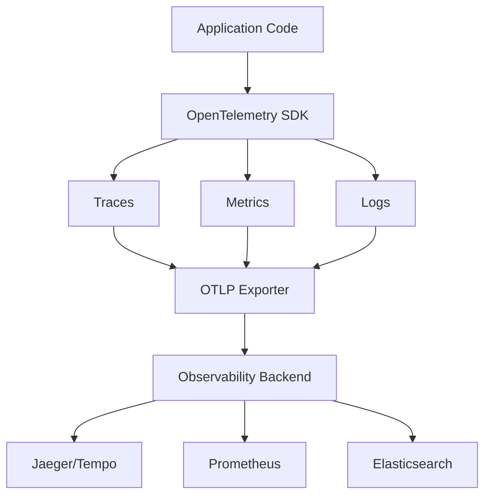
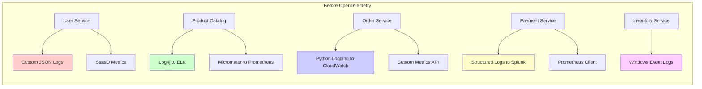
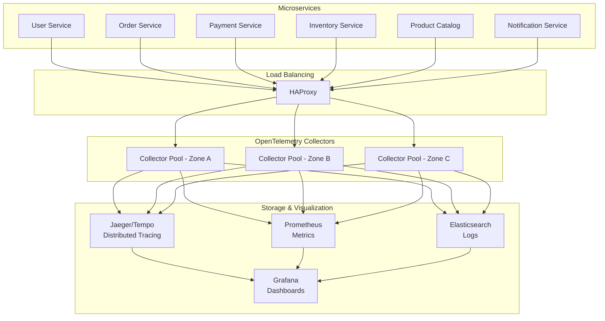

# OpenTelemetry in Microservices: How We Transformed Our Observability Strategy

## Introduction: The Observability Challenge We Faced

Picture this: It's 3 AM, and you're awakened by an alert. Your e-commerce platform is experiencing intermittent failures, but the error messages are cryptic. You have logs scattered across dozens of microservices, metrics in three different systems, and traces that don't connect across service boundaries. Sound familiar?

This was our reality eighteen months ago. Our microservices architecture had grown organically from a handful of services to over forty, each with its own logging approach, metrics collection, and sparse tracing implementation. We knew we needed a unified observability strategy, and that's when we discovered OpenTelemetry.

## Understanding OpenTelemetry: The Foundation of Modern Observability

Before diving into our implementation journey, let's establish what OpenTelemetry is and why it matters for microservices architectures.

OpenTelemetry (often abbreviated as OTel) is an open-source observability framework that provides a standardized way to collect and export telemetry data. Think of it as a universal translator for your application's vital signs – it speaks the language of logs, metrics, and traces fluently and can translate them into formats that various observability backends understand.

The framework emerged from the merger of two earlier projects: OpenTracing and OpenCensus. This unification created a vendor-neutral standard that has become the de facto approach for instrumenting cloud-native applications. What makes OpenTelemetry particularly powerful is its comprehensive approach to the three pillars of observability:

**1. Traces** tell the story of a request as it travels through your system, like following breadcrumbs through a forest of microservices.

**2. Metrics** provide the vital statistics – the heartbeat, blood pressure, and temperature of your applications.

**3. Logs** capture the detailed narrative, the "what happened and when" that helps you understand system behavior.



## Our Architecture: Before the Transformation

To understand why OpenTelemetry was transformative for us, you need to see where we started. Our e-commerce platform consisted of:

- **API Gateway**: Built with Kong, handling request routing
- **User Service**: Node.js application managing authentication and profiles
- **Product Catalog**: Java Spring Boot service with PostgreSQL
- **Order Service**: Python FastAPI with MongoDB
- **Payment Service**: Go microservice integrating with payment providers
- **Inventory Service**: .NET Core service with SQL Server
- **Notification Service**: Node.js service handling emails and SMS
- **Recommendation Engine**: Python service with machine learning models

Each service had evolved independently, resulting in a Tower of Babel situation for observability:



This heterogeneous landscape created several pain points:

1. **Correlation Complexity**: Tracing a single user request across services required manual correlation using timestamps and user IDs
2. **Monitoring Overhead**: We maintained five different monitoring dashboards
3. **Knowledge Silos**: Each team understood only their service's observability tools
4. **Debugging Difficulties**: Root cause analysis for cross-service issues took hours or days
5. **Cost Inefficiencies**: Multiple observability vendors meant redundant costs

## Why We Chose OpenTelemetry: The Decision Matrix

When evaluating observability solutions, we considered several options. Let me walk you through our decision-making process.

We evaluated three main approaches:

1. **Standardize on a Single Vendor**: Lock into one observability platform
2. **Build Custom Abstraction Layer**: Create our own instrumentation framework
3. **Adopt OpenTelemetry**: Implement the open standard

Our evaluation criteria focused on several key factors:

**Vendor Independence** was crucial. We'd been burned before by vendor lock-in, and OpenTelemetry's vendor-neutral approach meant we could switch backends without rewriting instrumentation code. As Martin Fowler discusses in his article on [Hexagonal Architecture](https://martinfowler.com/articles/hexagonal-architecture.html), keeping infrastructure concerns at the edges of your system provides flexibility.

**Language Support** mattered significantly given our polyglot architecture. OpenTelemetry provides first-class support for all our languages, with consistent APIs across platforms. This meant our Node.js developers and Java developers could speak the same observability language.

**Community and Ecosystem** health indicated long-term viability. With backing from major cloud providers and observability vendors, OpenTelemetry had the momentum we needed. The CNCF's [2023 survey](https://www.cncf.io/reports/cncf-annual-survey-2023/) showed OpenTelemetry adoption growing by 170% year-over-year.

**Performance Overhead** was a concern. Our benchmarks showed OpenTelemetry added less than 3% overhead when properly configured, which aligned with our performance SLAs.

**Migration Path** needed to be gradual. OpenTelemetry's compatibility with existing standards meant we could migrate service by service rather than requiring a big-bang approach.

## Implementation Strategy: The Phased Approach

Rather than attempting to instrument everything at once, we developed a phased strategy that minimized risk and maximized learning.

### Phase 1: Establishing the Foundation (Months 1-2)

We started by setting up the OpenTelemetry Collector as our central telemetry hub. Think of the Collector as a Swiss Army knife for telemetry data – it can receive data in multiple formats, process it, and export it to various backends.

```yaml
# otel-collector-config.yaml
receivers:
  otlp:
    protocols:
      grpc:
        endpoint: 0.0.0.0:4317
      http:
        endpoint: 0.0.0.0:4318
  
  # Bridge for existing Prometheus metrics
  prometheus:
    config:
      scrape_configs:
        - job_name: 'legacy-services'
          static_configs:
            - targets: ['inventory-service:9090']

processors:
  batch:
    timeout: 1s
    send_batch_size: 1024
  
  memory_limiter:
    check_interval: 1s
    limit_mib: 512
  
  resource:
    attributes:
      - key: environment
        value: production
        action: upsert

exporters:
  jaeger:
    endpoint: jaeger-collector:14250
    tls:
      insecure: false
  
  prometheus:
    endpoint: "0.0.0.0:8889"
  
  elasticsearch:
    endpoints: ["https://es-cluster:9200"]
    logs_index: otel-logs

service:
  pipelines:
    traces:
      receivers: [otlp]
      processors: [memory_limiter, batch]
      exporters: [jaeger]
    
    metrics:
      receivers: [otlp, prometheus]
      processors: [memory_limiter, batch]
      exporters: [prometheus]
    
    logs:
      receivers: [otlp]
      processors: [memory_limiter, batch, resource]
      exporters: [elasticsearch]
```

This configuration established our collector with three important design decisions:

1. **Protocol Support**: We enabled both gRPC and HTTP to accommodate different service preferences
2. **Backward Compatibility**: The Prometheus receiver allowed us to continue collecting metrics from services not yet migrated
3. **Processing Pipeline**: The batch processor improved efficiency, while the memory limiter prevented resource exhaustion

### Phase 2: Pilot Service Implementation (Months 2-3)

We chose the Order Service as our pilot for several reasons:
- It was critical enough to validate our approach
- Small enough to iterate quickly
- Had clear boundaries with other services
- The Python team was eager to improve observability

Here's how we instrumented the Order Service:

```python
# order_service/telemetry.py
import os
from opentelemetry import trace, metrics
from opentelemetry.sdk.trace import TracerProvider
from opentelemetry.sdk.trace.export import BatchSpanProcessor
from opentelemetry.sdk.metrics import MeterProvider
from opentelemetry.sdk.metrics.export import PeriodicExportingMetricReader
from opentelemetry.exporter.otlp.proto.grpc.trace_exporter import OTLPSpanExporter
from opentelemetry.exporter.otlp.proto.grpc.metric_exporter import OTLPMetricExporter
from opentelemetry.instrumentation.fastapi import FastAPIInstrumentor
from opentelemetry.instrumentation.pymongo import PymongoInstrumentor
from opentelemetry.instrumentation.requests import RequestsInstrumentor
from opentelemetry.sdk.resources import Resource
from opentelemetry.semconv.resource import ResourceAttributes

def configure_telemetry(app_name: str, app_version: str):
    """
    Configure OpenTelemetry for the Order Service.
    This setup ensures we capture traces, metrics, and logs with proper context.
    """
    
    # Define resource attributes that identify this service
    resource = Resource(attributes={
        ResourceAttributes.SERVICE_NAME: app_name,
        ResourceAttributes.SERVICE_VERSION: app_version,
        ResourceAttributes.DEPLOYMENT_ENVIRONMENT: os.getenv("ENVIRONMENT", "production"),
        "team": "orders-team",
        "language": "python"
    })
    
    # Configure Tracing
    tracer_provider = TracerProvider(resource=resource)
    
    # Set up the OTLP exporter for traces
    otlp_trace_exporter = OTLPSpanExporter(
        endpoint=os.getenv("OTEL_EXPORTER_OTLP_ENDPOINT", "otel-collector:4317"),
        insecure=os.getenv("OTEL_EXPORTER_OTLP_INSECURE", "true").lower() == "true"
    )
    
    # Use BatchSpanProcessor for better performance
    span_processor = BatchSpanProcessor(
        otlp_trace_exporter,
        max_export_batch_size=512,
        max_queue_size=2048,
        schedule_delay_millis=5000
    )
    
    tracer_provider.add_span_processor(span_processor)
    trace.set_tracer_provider(tracer_provider)
    
    # Configure Metrics
    metric_reader = PeriodicExportingMetricReader(
        OTLPMetricExporter(
            endpoint=os.getenv("OTEL_EXPORTER_OTLP_ENDPOINT", "otel-collector:4317"),
            insecure=os.getenv("OTEL_EXPORTER_OTLP_INSECURE", "true").lower() == "true"
        ),
        export_interval_millis=60000  # Export metrics every minute
    )
    
    meter_provider = MeterProvider(
        resource=resource,
        metric_readers=[metric_reader]
    )
    metrics.set_meter_provider(meter_provider)
    
    # Auto-instrument libraries
    FastAPIInstrumentor.instrument(tracer_provider=tracer_provider)
    PymongoInstrumentor.instrument(tracer_provider=tracer_provider)
    RequestsInstrumentor.instrument(tracer_provider=tracer_provider)
    
    return trace.get_tracer(app_name), metrics.get_meter(app_name)

# order_service/main.py
from fastapi import FastAPI, Request
from contextlib import asynccontextmanager
import time
from telemetry import configure_telemetry
from opentelemetry import trace
from opentelemetry.trace import Status, StatusCode

# Initialize telemetry before creating the app
tracer, meter = configure_telemetry("order-service", "1.2.0")

# Create metrics instruments
order_counter = meter.create_counter(
    "orders_created_total",
    description="Total number of orders created",
    unit="orders"
)

order_value_histogram = meter.create_histogram(
    "order_value_dollars",
    description="Distribution of order values",
    unit="dollars"
)

order_processing_duration = meter.create_histogram(
    "order_processing_duration_seconds",
    description="Time taken to process an order",
    unit="seconds"
)

@asynccontextmanager
async def lifespan(app: FastAPI):
    # Startup
    print("Starting Order Service with OpenTelemetry instrumentation")
    yield
    # Shutdown
    print("Shutting down Order Service")

app = FastAPI(lifespan=lifespan)

@app.post("/orders")
async def create_order(request: Request, order_data: dict):
    """
    Create a new order with comprehensive telemetry.
    This demonstrates manual instrumentation alongside auto-instrumentation.
    """
    
    # Get the current span from auto-instrumentation
    current_span = trace.get_current_span()
    
    # Add custom attributes to the span
    current_span.set_attribute("order.customer_id", order_data.get("customer_id"))
    current_span.set_attribute("order.total_items", len(order_data.get("items", [])))
    
    start_time = time.time()
    
    try:
        # Create a child span for inventory check
        with tracer.start_as_current_span("check_inventory") as inventory_span:
            inventory_span.set_attribute("items.count", len(order_data.get("items", [])))
            
            # Simulate inventory check
            available = await check_inventory(order_data["items"])
            
            if not available:
                inventory_span.set_status(Status(StatusCode.ERROR, "Insufficient inventory"))
                raise ValueError("Insufficient inventory")
        
        # Create a child span for payment processing
        with tracer.start_as_current_span("process_payment") as payment_span:
            payment_span.set_attribute("payment.method", order_data.get("payment_method"))
            payment_span.set_attribute("payment.amount", order_data.get("total_amount"))
            
            payment_result = await process_payment(order_data)
            payment_span.set_attribute("payment.transaction_id", payment_result["transaction_id"])
        
        # Record metrics
        order_counter.add(1, {"payment_method": order_data.get("payment_method")})
        order_value_histogram.record(order_data.get("total_amount", 0))
        
        # Record processing duration
        duration = time.time() - start_time
        order_processing_duration.record(duration)
        
        current_span.set_status(Status(StatusCode.OK))
        
        return {
            "order_id": "ORD-12345",
            "status": "confirmed",
            "estimated_delivery": "2024-01-15"
        }
        
    except Exception as e:
        current_span.set_status(Status(StatusCode.ERROR, str(e)))
        current_span.record_exception(e)
        
        # Record failed order metric
        order_counter.add(1, {"payment_method": order_data.get("payment_method"), "status": "failed"})
        
        raise
```

This implementation showcases several important patterns:

1. **Resource Attributes**: We defined service-level attributes that get attached to all telemetry
2. **Auto-instrumentation**: Libraries like FastAPI, PyMongo, and Requests were automatically instrumented
3. **Manual Instrumentation**: We added custom spans for business-critical operations
4. **Error Handling**: Exceptions were properly recorded in traces
5. **Metrics Collection**: Business metrics were collected alongside operational metrics

### Phase 3: Expanding to Critical Path Services (Months 3-5)

After validating our approach with the Order Service, we expanded to services in the critical order flow: Payment Service (Go) and Inventory Service (.NET).

For the Go Payment Service, we leveraged OpenTelemetry's excellent Go support:

```go
// payment_service/telemetry/telemetry.go
package telemetry

import (
    "context"
    "fmt"
    "os"
    
    "go.opentelemetry.io/otel"
    "go.opentelemetry.io/otel/attribute"
    "go.opentelemetry.io/otel/exporters/otlp/otlptrace/otlptracegrpc"
    "go.opentelemetry.io/otel/exporters/otlp/otlpmetric/otlpmetricgrpc"
    "go.opentelemetry.io/otel/propagation"
    "go.opentelemetry.io/otel/sdk/metric"
    "go.opentelemetry.io/otel/sdk/resource"
    "go.opentelemetry.io/otel/sdk/trace"
    semconv "go.opentelemetry.io/otel/semconv/v1.17.0"
)

// InitTelemetry initializes OpenTelemetry with traces and metrics
func InitTelemetry(ctx context.Context, serviceName, serviceVersion string) (func(), error) {
    // Create resource with service information
    res, err := resource.Merge(
        resource.Default(),
        resource.NewWithAttributes(
            semconv.SchemaURL,
            semconv.ServiceName(serviceName),
            semconv.ServiceVersion(serviceVersion),
            attribute.String("environment", os.Getenv("ENVIRONMENT")),
            attribute.String("team", "payments-team"),
        ),
    )
    if err != nil {
        return nil, fmt.Errorf("failed to create resource: %w", err)
    }
    
    // Set up trace exporter
    traceExporter, err := otlptracegrpc.New(ctx,
        otlptracegrpc.WithEndpoint(os.Getenv("OTEL_EXPORTER_OTLP_ENDPOINT", "otel-collector:4317")),
        otlptracegrpc.WithInsecure(),
    )
    if err != nil {
        return nil, fmt.Errorf("failed to create trace exporter: %w", err)
    }
    
    // Create trace provider with batching for better performance
    tracerProvider := trace.NewTracerProvider(
        trace.WithBatcher(traceExporter),
        trace.WithResource(res),
        trace.WithSampler(trace.AlwaysSample()), // In production, use trace.TraceIDRatioBased(0.1)
    )
    
    // Set up metric exporter
    metricExporter, err := otlpmetricgrpc.New(ctx,
        otlpmetricgrpc.WithEndpoint(os.Getenv("OTEL_EXPORTER_OTLP_ENDPOINT", "otel-collector:4317")),
        otlpmetricgrpc.WithInsecure(),
    )
    if err != nil {
        return nil, fmt.Errorf("failed to create metric exporter: %w", err)
    }
    
    // Create metric provider
    meterProvider := metric.NewMeterProvider(
        metric.WithReader(metric.NewPeriodicReader(metricExporter)),
        metric.WithResource(res),
    )
    
    // Set global providers
    otel.SetTracerProvider(tracerProvider)
    otel.SetMeterProvider(meterProvider)
    
    // Set up propagators for distributed tracing
    otel.SetTextMapPropagator(propagation.NewCompositeTextMapPropagator(
        propagation.TraceContext{},
        propagation.Baggage{},
    ))
    
    // Return a cleanup function
    cleanup := func() {
        ctx := context.Background()
        tracerProvider.Shutdown(ctx)
        meterProvider.Shutdown(ctx)
    }
    
    return cleanup, nil
}
```

The Go implementation highlighted OpenTelemetry's consistency across languages – the concepts remained the same even as the syntax changed.

### Phase 4: Observability Infrastructure Evolution (Months 5-6)

As we instrumented more services, we evolved our observability infrastructure to handle the increased telemetry volume:



Key infrastructure decisions included:

**Collector Scaling**: We deployed OpenTelemetry Collectors as a StatefulSet in Kubernetes with horizontal pod autoscaling based on CPU and memory usage. This handled our peak load of 50,000 spans per second.

**High Availability**: HAProxy distributed telemetry data across collector pools in different availability zones, ensuring no single point of failure.

**Storage Optimization**: We implemented sampling strategies to manage storage costs while maintaining visibility:

```yaml
# Tail-based sampling configuration
processors:
  tail_sampling:
    decision_wait: 10s
    num_traces: 100000
    expected_new_traces_per_sec: 10000
    policies:
      - name: errors-policy
        type: status_code
        status_code: {status_codes: [ERROR]}
        
      - name: slow-traces-policy  
        type: latency
        latency: {threshold_ms: 1000}
        
      - name: important-services
        type: and
        and:
          - name: service-name-policy
            type: string_attribute
            string_attribute:
              key: service.name
              values: [payment-service, order-service]
              
      - name: probabilistic-policy
        type: probabilistic
        probabilistic: {sampling_percentage: 10}
```

This configuration ensured we kept 100% of error traces, all slow traces, all traces from critical services, and a 10% sample of everything else.

## Tackling Implementation Challenges

Our journey wasn't without obstacles. Let me share the key challenges we faced and how we overcame them.

### Challenge 1: Context Propagation Across Async Boundaries

Python's async/await pattern initially broke our trace context propagation. When a request spawned background tasks, we lost the trace context:

```python
# The problem:
async def create_order(order_data):
    # This worked - context was preserved
    await validate_order(order_data)
    
    # This didn't work - context was lost
    asyncio.create_task(send_order_notification(order_data))
    
# The solution:
from opentelemetry import context as otel_context

async def create_order(order_data):
    await validate_order(order_data)
    
    # Capture current context
    ctx = otel_context.get_current()
    
    # Create task with context
    asyncio.create_task(
        send_order_notification_with_context(order_data, ctx)
    )

async def send_order_notification_with_context(order_data, ctx):
    # Restore context in the background task
    token = otel_context.attach(ctx)
    try:
        await send_order_notification(order_data)
    finally:
        otel_context.detach(token)
```

### Challenge 2: Performance Impact in High-Volume Services

Our Product Catalog service handled 10,000 requests per second. Initial instrumentation added 15% latency – unacceptable for our SLAs.

We optimized through several approaches:

1. **Sampling at the Edge**: Implemented head-based sampling in the API Gateway
2. **Batch Processing**: Increased batch sizes and export intervals
3. **Selective Instrumentation**: Disabled automatic instrumentation for non-critical paths

The result was a reduction to 2.5% overhead, well within our performance budget.

### Challenge 3: Correlating Logs with Traces

Our existing logs didn't include trace context, making correlation difficult. We developed a pattern for enhancing logs with trace information:

```python
# Enhanced logging with trace context
import logging
from opentelemetry import trace
from opentelemetry.trace import format_trace_id, format_span_id

class TraceContextFilter(logging.Filter):
    """Add trace context to log records"""
    
    def filter(self, record):
        span = trace.get_current_span()
        if span.is_recording():
            span_context = span.get_span_context()
            record.trace_id = format_trace_id(span_context.trace_id)
            record.span_id = format_span_id(span_context.span_id)
            record.service_name = "order-service"
        else:
            record.trace_id = "000000000000000000000000000000"
            record.span_id = "0000000000000000"
            record.service_name = "order-service"
        return True

# Configure structured logging
logging.basicConfig(
    format='{"timestamp": "%(asctime)s", "level": "%(levelname)s", '
           '"trace_id": "%(trace_id)s", "span_id": "%(span_id)s", '
           '"service": "%(service_name)s", "message": "%(message)s"}',
    level=logging.INFO
)

logger = logging.getLogger(__name__)
logger.addFilter(TraceContextFilter())
```

This approach allowed us to click from a trace span directly to related logs in Elasticsearch.

## Measuring Success: The Transformation Impact

After six months of implementation, the results spoke for themselves:

**Mean Time to Detection (MTTD)** dropped from 45 minutes to 5 minutes. Distributed tracing made issues immediately visible.

**Mean Time to Resolution (MTTR)** improved from 3 hours to 30 minutes. Engineers could follow a request through its entire lifecycle.

**Cross-team Collaboration** improved dramatically. The shared observability language broke down silos.

**Cost Optimization** resulted in 30% reduction in observability spending by consolidating vendors and implementing intelligent sampling.

**Developer Productivity** increased as measured by our quarterly surveys. 89% of engineers reported spending less time debugging production issues.

Here's a before-and-after view of investigating a typical production issue:

```mermaid
graph TD
    subgraph "Before OpenTelemetry"
        A1[Alert: High Error Rate] --> B1[Check Service Logs]
        B1 --> C1[Manually Correlate Timestamps]
        C1 --> D1[SSH to Multiple Servers]
        D1 --> E1[Grep Through Logs]
        E1 --> F1[Guess at Root Cause]
        F1 --> G1[3+ Hours to Resolution]
        
        style G1 fill:#ffcccc
    end
    
    subgraph "After OpenTelemetry"
        A2[Alert: High Error Rate] --> B2[Open Trace in Grafana]
        B2 --> C2[See Full Request Flow]
        C2 --> D2[Identify Failing Service]
        D2 --> E2[View Correlated Logs/Metrics]
        E2 --> F2[Fix Root Cause]
        F2 --> G2[30 Minutes to Resolution]
        
        style G2 fill:#ccffcc
    end
```



## Best Practices and Lessons Learned

Through our journey, we developed several best practices that I recommend for any team implementing OpenTelemetry:

### 1. Start with Auto-Instrumentation

Begin with automatic instrumentation for frameworks and libraries. This provides immediate value with minimal effort. Manual instrumentation should focus on business-critical paths and custom metrics.

### 2. Implement Semantic Conventions

Follow OpenTelemetry's [semantic conventions](https://opentelemetry.io/docs/concepts/semantic-conventions/) religiously. Consistent attribute naming across services makes querying and alerting much easier:

```python
# Good: Using semantic conventions
span.set_attribute("http.method", "POST")
span.set_attribute("http.route", "/api/orders")
span.set_attribute("http.status_code", 200)

# Bad: Custom attribute names
span.set_attribute("request_method", "POST")
span.set_attribute("endpoint", "/api/orders")
span.set_attribute("response_code", 200)
```

### 3. Design for Sampling from Day One

Implement sampling strategies early. We learned this the hard way when our tracing storage costs exploded. Consider both head-based and tail-based sampling:

- Head-based sampling at service entry points for predictable volume
- Tail-based sampling at collectors for keeping interesting traces

### 4. Create Service-Level Dashboards

Build dashboards that show the golden signals (latency, traffic, errors, saturation) for each service. We created a template that every service could customize:

```json
{
  "dashboard": {
    "title": "${service_name} Golden Signals",
    "panels": [
      {
        "title": "Request Rate",
        "query": "rate(http_server_requests_total{service_name=\"${service_name}\"}[5m])"
      },
      {
        "title": "Error Rate",
        "query": "rate(http_server_requests_total{service_name=\"${service_name}\",status_code=~\"5..\"}[5m])"
      },
      {
        "title": "P95 Latency",
        "query": "histogram_quantile(0.95, rate(http_server_duration_seconds_bucket{service_name=\"${service_name}\"}[5m]))"
      },
      {
        "title": "CPU Usage",
        "query": "rate(process_cpu_seconds_total{service_name=\"${service_name}\"}[5m])"
      }
    ]
  }
}
```

### 5. Educate Your Teams

Observability is a practice, not just a technology. We ran workshops covering:
- How to read distributed traces
- Writing effective queries
- Creating meaningful alerts
- Debugging with traces and metrics

### 6. Version Your Telemetry

Treat telemetry configuration as code. Version it, review it, and test it:

```yaml
# telemetry/v1.2.0/base-config.yaml
apiVersion: v1
kind: TelemetryConfig
metadata:
  version: 1.2.0
  description: Added new custom metrics for cart abandonment
spec:
  traces:
    sampling_rate: 0.1
    include_errors: always
  metrics:
    - name: cart_abandonment_rate
      type: histogram
      description: Rate of cart abandonment by step
  logs:
    include_trace_context: true
```

## Looking Forward: The Continuous Journey

Implementing OpenTelemetry transformed our observability capabilities, but the journey continues. We're now exploring:

**Continuous Profiling**: Adding profiling data as the fourth pillar of observability using projects like [Pyroscope](https://pyroscope.io/)

**AIOps Integration**: Using machine learning to detect anomalies in our telemetry data

**Business Metrics Correlation**: Connecting technical metrics with business KPIs for better decision-making

**Edge Observability**: Extending OpenTelemetry to our edge services and CDN

## Resources for Your Journey

If you're embarking on your own OpenTelemetry journey, these resources proved invaluable:

1. [OpenTelemetry Documentation](https://opentelemetry.io/docs/) - The official docs are comprehensive and well-maintained
2. [Distributed Tracing in Practice](https://www.oreilly.com/library/view/distributed-tracing-in/9781492056638/) by Austin Parker - Essential reading for understanding distributed tracing
3. [The RED Method](https://www.weave.works/blog/the-red-method-key-metrics-for-microservices-architecture/) - For choosing the right metrics
4. [Google SRE Books](https://sre.google/books/) - For understanding observability in the context of reliability

## Conclusion: The Observability Transformation

Our OpenTelemetry implementation journey transformed not just our technology stack, but our engineering culture. We moved from reactive firefighting to proactive optimization. Issues that once took hours to diagnose now take minutes. Most importantly, our teams now share a common observability language that breaks down silos and accelerates innovation.

The path wasn't always smooth, but the destination was worth it. OpenTelemetry provided the foundation for observability that scales with our architecture, adapts to our needs, and prepares us for future challenges.

If you're considering OpenTelemetry for your microservices architecture, my advice is simple: start small, iterate quickly, and focus on value. Begin with one service, prove the value, and expand systematically. The observability transformation awaits, and OpenTelemetry is your guide.

---

*This post represents our 18-month journey implementing OpenTelemetry. Your mileage may vary, but the principles remain constant: unified observability accelerates understanding, and understanding accelerates everything else.*